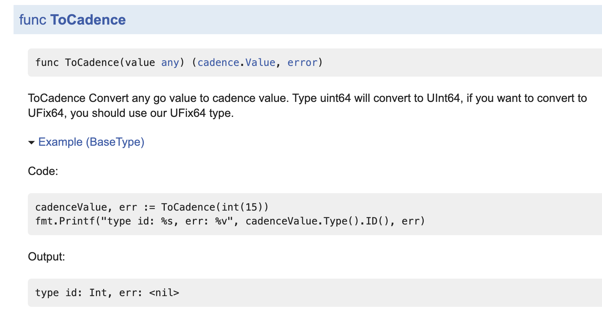

# 测试
## 清除测试缓存

Go 测试在运行通过后，会缓存结果，在检测到没有代码改动的情况下，下次会直接显示通过

可以使用以下命令清除缓存

```Go
go clean -testcache
```


## 运行所有测试

可以在项目根目录运行以下命令来跑完所有包里面的测试

```Bash
go test $(go list ./...)
```


其中`go list ./...`是列出当前目录下的所有包

没有在 cmd 和 powershell 中尝试

## 踩过的坑

### 有一个测试在单独运行时正常，和包中的另一个测试一起运行时出错

原因：函数 A 带有缓存，函数 B 依赖函数 A，在测试函数 A 时，A 产生了缓存，再测试 B 时，B 获得的是 A 的缓存，因此 B 没有获得期望的返回，B 测试无法通过


## 查看代码覆盖率

Go VSCode 插件就可以做到，打开指令面板，选择`Go: Toggle Test Coverage In Current Package`就可以了，它会先运行一遍测试再显示覆盖率，可能会有点慢

## 基准测试

当对性能要求比较严格时，需要运行的测试，需要更多的了解。

## 示例

能显示在文档中的示例，如下：



示例应当写在`*_test.go`文件中，也会被测试框架运行


## 关于测试

- 数组中的元素，字段中包含 time.Time 时，从数据库中取出的结果是和存入时不同的，不要直接用 ElementsMatch 来比较
