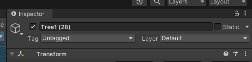
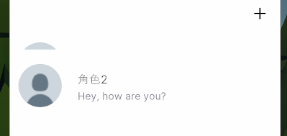
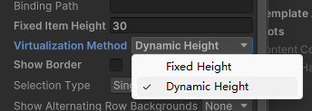
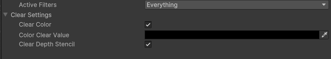

# 错误收集
## 物体的位置被改变，但物体依然保持原位

前往检查器中查看物体是否勾选了`static`属性，取消勾选即可正常看到物体被移动

## UI Toolkit 提供的 ListView 的子项目高度与项目真正高度不一致

像这样，项目高度为 100，但在列表中高度仅为 30

因为 ListView 的 Virtualization Method 默认为 Fixed Height，就会按照上面的 Fixed Item Height 字段来设置高度，忽略子项目真正的高度，需要设置成 Dynamic Height

## 用 RenderTexture 渲染 UI 时，UI 的透明背景并不能应用到 Texture 中去

需要到 UI 对应的 PanelSettings 里面设置

Clear Color ☑️ Color Clear Value #00000000

