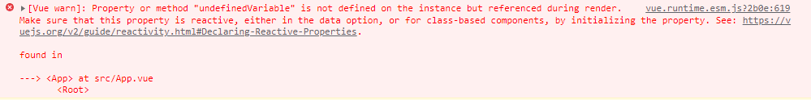
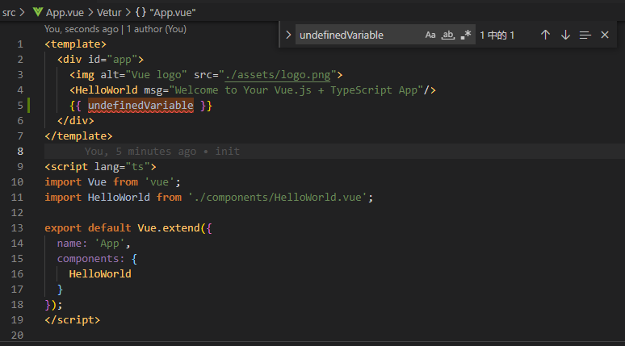

# template 块中引用的变量不存在

图片中报了个错：`undefinedVariable`变量不存在，但是在渲染的过程中引用到了这个变量，并且给出了位置，在App.vue

解决方法：去到App.vue 中寻找`undefinedVariable`，最好直接用全文搜索，然后检查这个变量的拼写是否错误，检查Vue实例中有没有定义类似名称的变量，想想这个名称的变量以前叫什么（重命名后忘记修改引用的时候经常遇到）

可以发现在第 5 行的“双括号表达式”中引用了`undefinedVariable`，而 Vue 实例中没有定义`undefinedVariable`，删除引用的代码即可

