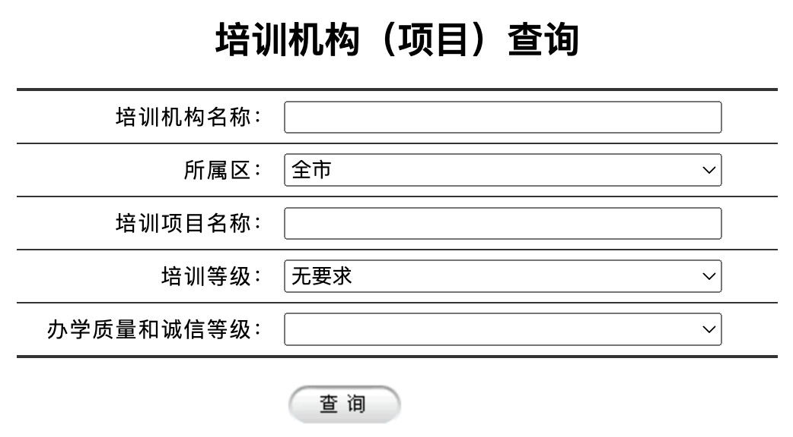
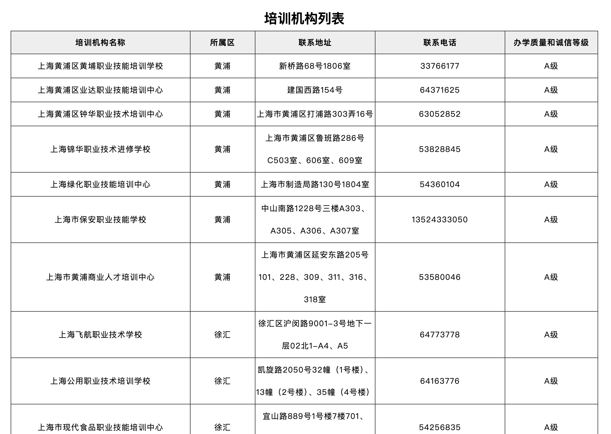

# 培训机构查询

## 上海

1. 人社局官方查询页面：[https://www.rsj.sh.gov.cn/sbsjb/zypx/pages/pxjgcx.jsp](<https://www.rsj.sh.gov.cn/sbsjb/zypx/pages/pxjgcx.jsp>)
	

	
	直接点击查询即可查到所有已登记的培训机构。
	
	

	

	
	
	
	

1. 点击任意查询结果可查看招生详情和培训内容。
	

	
	
	
	

相关内容：

- 人社局政务公开热点回复页面：[https://rsj.sh.gov.cn/trdhy_17355/20230523/t0035_1415716.html](<https://rsj.sh.gov.cn/trdhy_17355/20230523/t0035_1415716.html>)
	

	
	为防止页面丢失，这里备份了一份
	
	

	

	
	
	
	

- 微信公众号：上海学习堂
	

	
	他们会整理各种职业技能培训的开班计划。
	
	

