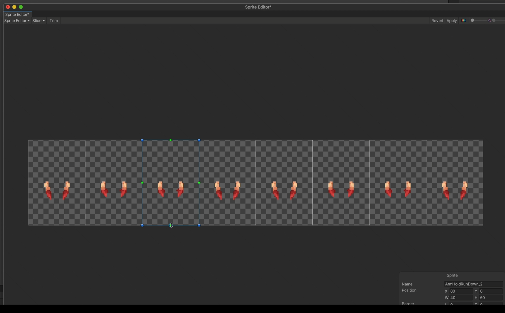

# Unity

## 瓦片地图设置

- Sprite Mode：Multiple

- Pxiels Per Unit：不是固定的，需要与画师沟通好，并且标在文件末尾

- Filter Mode：
	- Point：无过滤，适合在像素游戏中使用

- Compression：
	- None：无压缩，适合在像素游戏中使用

- Max Size：尽量不要超过 2048，选择比图片集中最大的图片大，但是小于更大级别的选项

## 属性预设

如果有大量资源的设置相同，可以创建一个预设

1. 点击检查器右上角设置图标

1. 点击“Save Current To Preset”

1. 选择一个位置即可

应用预设

1. 选中所有需要应用预设的资源

1. 点击检查器右上角设置图标

1. 选择刚刚保存的预设

## 图片编辑器设置

在检查器中点击 Sprite Editor 就能打开编辑器

- Slice 切割
	- Type 类型
		- Auto 自动切割
		- Grid By Cell Size 根据单元像素大小进行切割
		- Grid By Cell Count 根据行列的数量进行切割，会平均分配所有的格子
	- Method 切割方法
		- Smart 只保留有画像素的部分，并且在将来可以直接添加新部分

## 图层排序

- 当制作俯视角游戏时，动画帧的锚点选择在底部可以实现想要的图层排序，可以做到更好的遮挡效果（为什么？）
	

	
	
	
	

