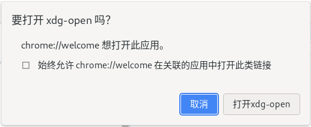

# X 窗口系统
<p id="ximEvzoQd93BZ3Gx7HfAjU">

X 窗口系统是一种很古老但依然被大量 Linux 发行版使用或兼容的窗口系统。

</p>


<p id="pCwiHQSkLkaNM595TGMGQf">

`XDG Desktop`关于桌面入口文件的标准

</p>


<p id="oopR4ugBS6rtnfcUyCLdi2">


</p>


<p id="kbDr6dxYWMc2Xt2DsLx1QH">

## 桌面图标

</p>


<p id="sChWzke4MWAJNdSEcNxvx4">

在`~/.local/share/applications`中创建一个`.desktop`文件，比如我们为`Godot`编辑器创建一个桌面图标，那么我们要创建一个`.desktop`，比如`godot.desktop`，内容如下：

</p>


<p id="va1VRhsUER7DYsKjpc9fjT">

```Bash
[Desktop Entry]
Type=Application
Name=Godot
Exec=/usr/local/bin/godot
```


</p>


<p id="6yaFcViG4an6FRhoUUfm1f">

（可选）通过运行命令来更新桌面数据库：

</p>


<p id="3RaszzuJMx5wTMonfRVo4">

```Bash
$ update-desktop-database ~/.local/share/applications
```


</p>


<p id="qkmvTzKWbSZEsfxq2GycAZ">

### 问题解决

</p>


1. 在桌面启动应用时不会加载环境变量，因此要求从环境变量中读取内容的应用无法读取到环境变量
	<p id="xzbkAn6zyTCpkfsL85YPnR">
	
	解决方案：
	
	</p>
	<p id="xAsuskgBUrpNBGnsgit9W8">
	
	在`~/.xsessionrc`中加入环境变量定义
	
	</p>
	<p id="gKkUQezLEwiCi23uR5ypqc">
	
	```Bash
	export THE_VARIABLE='value'
	```
	
	
	</p>


<p id="sfqxp18UVjRHkyLQ9L18MF">

## 自定义协议

</p>


<p id="krftKjct9pvrdhW3XRiWnm">

如果你希望你的程序能够处理你自定义的协议，比如`godot://`，你需要在`godot.desktop`文件中新增一行：

</p>


<p id="3CyUY3HLQVXJ9MSqctzfq3">

```Bash
MimeType=x-scheme-handler/godot
```


</p>


<p id="uXn5QXZvVgZDVy9N1o83ZU">

并且在`~/.local/share/applications/mimeapps.list`的`[Default Applications]`区域下加入这样一行：

</p>


<p id="cviuEjYwQpvrcKtumSVNLh">

```Bash
[Default Applications]
x-scheme-handler/godot=godot.desktop
```


</p>


<p id="5djYCTsCcSpS4VmYr1J9J3">

添加完成后，可以尝试在浏览器的终端中输入`location.href="godot://project"`，可能会弹出这样的框：

</p>


<p id="AZw17iszajn4bP6BhMUwt">



</p>


<p id="pQfEo6bvcGNJ87dpn7n8mh">

`xdg-open`是一个软件包，它可以用于打开文件或者链接，因此它劫持了所有的自定义协议，如果点击`打开 xdg-open`之后依然没有反应，可能是配置错了。

</p>


