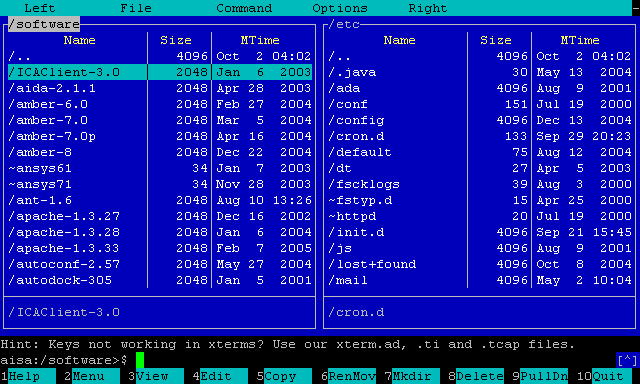

# 使用 Whiptail 和 Dialog 实现(TUI)文本界面
<p id="rEpgASmdhYu4yDsfZcsYYt">

## TUI是什么

</p>


<p id="8sYutpPRNuZJneaFNV5YqN">

TUI全称Text-based user interface（基于文本的用户界面），在终端实现GUI的效果，它长这样：

</p>


<p id="k5g66enTL2FYK9Cq62cNwf">



</p>


<p id="dUDxE9h8V2xygCyTMSwnTJ">

这篇文章讲述如何在Linux中实现带TUI的bash脚本

</p>


<p id="6axi1MK7HSehW7xpJmg5sE">

Whiptail存在于大多数Linux发行版本中，一般不需要安装，Whiptail是精简版的Dialog。

</p>


<p id="czFbQNuuCSKP8KjLFZzKLE">

如果没有：

</p>


<p id="9vPVpVwBfzmbZ1b8UHJzxn">

```Bash
sudo apt install whiptail
sudo apt install dialog
```


</p>


<p id="eZx6sDqr4Zs6igZyw6tiam">


</p>


