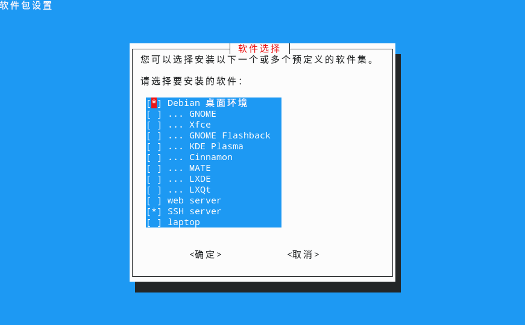

# 移除Debian默认SDDM界面并保留KDE-plasma桌面
<p id="CzDVGUMJENujAWeLTxQ2G">

# ⚠️ 注意！！ 进行该操作前请务必做好备份工作，操作过程中可能会破坏系统组件导致无法正常启动！

</p>


<p id="tpBSqxzXVSKfGo6riXpZju">

::: tip 📌
在debian、ubuntu等debian发行版本中使用Tasksel 安装桌面后会遇到无法在Tasksel 中卸载桌面的情况。
:::

</p>


<p id="xz5VotjaGaTUiuaVruNof8">

## 卸载多余的桌面环境

</p>


<p id="vzHrVZRUngF4qgdVqUKt7s">

启动Tasksel查看已安装的桌面环境

</p>


<p id="u6hiEqzJFMB4SC3F8eP6JF">

```Bash
sudo tasksel 
```


</p>


<p id="3qKmj7eGXXJ7gte7FLRHxm">



</p>


<p id="3okK6PisAHeSVpYM95w5DE">

卸载GNOME

</p>


<p id="58gsG9bvvxQ41DPe9cEgxP">

```Bash
sudo apt-get remove --purge gnome-shell gnome-core gnome-session gnome-settings-daemon gnome-control-center
```


</p>


<p id="34CWMyN4zv1QLGF8eHTxkF">

卸载XFCE

</p>


<p id="tzGqXKrK9MuL9p5meYpN7h">

```Bash
sudo apt-get remove --purge xfce4 xfce4-goodies
```


</p>


<p id="pByg8QKiNFLhfcDeVLsWNj">

卸载LXDE

</p>


<p id="uw41SfHsiZDmtoHactsxZK">

```Bash
sudo apt-get remove --purge lxde lxde-core lxde-common
```


</p>


<p id="b2DpNWGPdu4zxMvXfnxycQ">

卸载Cinnamon

</p>


<p id="2AmHkcWwwvC5RsDuhRWXo8">

```Bash
sudo apt-get remove --purge cinnamon cinnamon-core cinnamon-desktop-environment
```


</p>


<p id="4NCuhq5rquCq9rKee99XxH">

卸载Mate

</p>


<p id="q762oGGnBsuWDzCSmCPTgq">

```Bash
sudo apt-get remove --purge mate-desktop-environment
```


</p>


<p id="oJf27JbPugtsNucML2MsLo">

卸载LXQT

</p>


<p id="nG2Td6j8HLQnRDsY638Pi3">

```Bash
sudo apt-get remove --purge lxqt-core lxqt-panel
```


</p>


<p id="nUqhP5L8NrQKfua2nvRGK8">

清理未使用的附加依赖包

</p>


<p id="9Uhjnh4rH8sAtrNmFBScQv">

```Bash
sudo apt-get autoremove --purge
sudo apt-get clean

```


</p>


<p id="5KUwe3pZLdCvf962FaERf">

卸载并重新安装SDDM

</p>


<p id="3x81e8whabtKAPj1aHztQP">

```Bash
sudo apt-get remove --purge sddm
sudo apt-get autoremove --purge
sudo apt-get clean

sudo apt-get update
sudo apt-get install sddm

```


</p>


<p id="2Y3jXjwp65xdooEbL6ASgc">

完全安装KDE-Plasma

</p>


<p id="t6KyD35xgLaLdq6gHuCEMk">

```Bash
sudo apt-get install --reinstall kde-full
```


</p>


<p id="qoAs2rKa8cWBPQuydEr8WZ">

## 如果无法进入桌面，可以尝试以下方法

</p>


<p id="wtYXwD4EnJPnkuRexzQBmQ">

将现在的配置文件夹重命名，程序会自动创建新的文件夹和配置

</p>


<p id="dcFQ9TApbJzjX22716zjWW">

```Bash
mv ~/.config ~/.config_backup
mv ~/.local ~/.local_backup
```


</p>


<p id="8i9qGQ3pA2qfNdNP9Vnwku">

如果可以通过`startx`命令启动桌面环境但是开机不会进入桌面

</p>


<p id="eA947Pxdr713j8mSwwjbZv">

配置SDDM 自动登录

</p>


<p id="oxQ8E7ptjzWQngnWdtRwbu">

```Bash
sudo nano /etc/sddm.conf


```


</p>


<p id="b3gBVynbnyd4rpMyaDL1m">

```Ini
[Autologin]
User=your-username
Session=plasma.desktop
```


</p>


<p id="oXPGnbE238wRpuruHQtTdD">


</p>


