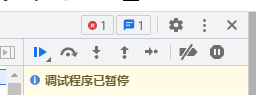

# Chrome
<p id="vtec1865uskJbDz3Tc5hub">

## 陀螺仪模拟

</p>


<p id="42SKZQZsy9inaM8eYuegyS">

Chrome 可以在开发者工具中打开传感器视图，模拟陀螺仪状态

</p>


<p id="hFd7Y4Kmh3F8ymDf5xmbFS">

## 调试 Android 上的 Chrome

</p>


1. 打开手机的开发者模式和 USB 调试


1. 连接手机和电脑


1. 进入`chrome://inspect/#devices`页面


1. 选择手机上打开的标签页，点击 inspect 开始调试


<p id="3AvUh5vKKqXZPcNiBWVekv">

## 反反调试技巧

</p>


<p id="eMFGgvACXJKWoBSE1vrKj9">

当遇到一开Devtools 就疯狂调试模式的网站时，只需要点左起倒数第二个图标，禁用所有断点即可

</p>


<p id="7Lsqfk4VAAQJPkz4yo5GR3">



</p>


<p id="gLsqVke3bnX64YebH9Wv4U">

## 启动时指定配置文件（用户）

</p>


<p id="wpQuJCztGVyAW3m8bEtztB">

```JavaScript
path/to/chrome.exe --profile-directory="[配置文件名]" |--- 默认配置文件名Default，其它配置文件Profile [编号]，编号从1开始

```


</p>


<p id="oW56D3HBRE3fkLDDJKsHwL">

## 暗色/亮色模式调试

</p>


<p id="dhMygzCUoLdcdrioyKc4qS">

windows按 ctrl + shift + p

</p>


<p id="tccxG9A2n4nGuRvUmPNeoH">

mac按 command + shift + p

</p>


<p id="eZdKRybpd8zEQyXGBqhEYW">

然后输入dark theme

</p>


<p id="dux8YHPs8oEyPLpP4BsfJd">

## Chrome 在 macOS 上占用过大空间的解决方法

</p>


<p id="aatvKLF36N3H8YJCevXiSS">


</p>


<p id="jDzuKQgajsBmzWp2rZQfoF">

`2023/08/18`目前已经不在`/Applications/Google Chrome.app/Contents/Versions`，底下，而是在`/Applications/Google\ Chrome.app/Contents/Frameworks/Google Chrome Framework.framework/Versions`下，保留最近的三个版本即可

</p>


<p id="vyNv99b5HusGuuovGhjAUc">


</p>


