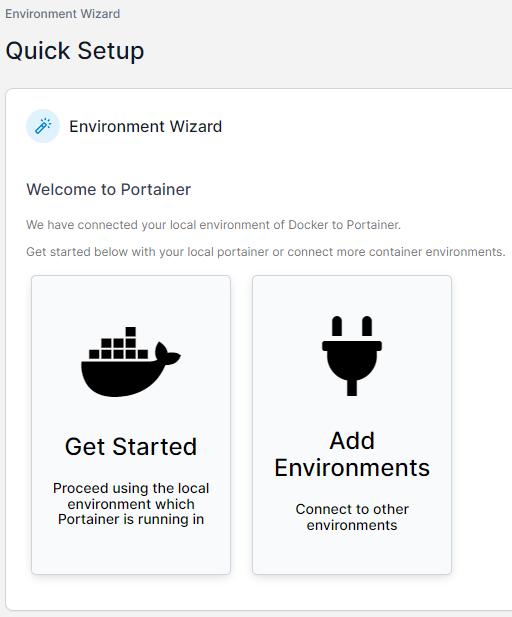
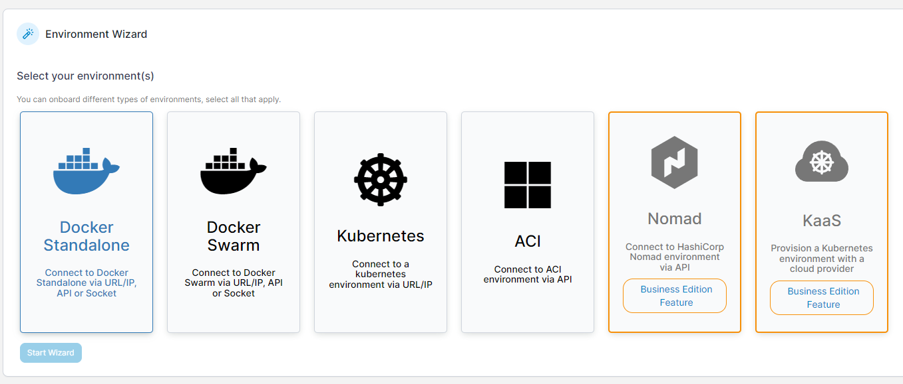
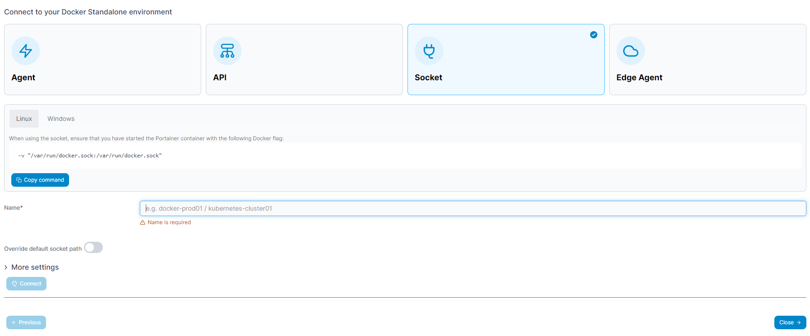

# Portainer 图形化容器管理器
群晖自带的 Docker 套件不够好用，用命令行又太麻烦，Portainer 是一个图形化的容器管理器，支持 Docker 基础，Docker Swarm 集群，k8s，不一定要运行在需要管理的容器服务的主机上

## 为基础的 Docker 安装并设置：2.16.2 版本

运行以下命令来运行 Portainer，`-v`旗标的意义之后再解释，如果是群晖 Docker 套件，请使用 SSH 连接

```Go
sudo docker run -dit -p 9443:9443 --restart=always -v /var/run/docker.sock:/var/run/docker.sock --name portainer portainer/portainer-ce:2.16.2
```


运行之后即可在 9443 端口访问 Portainer 的管理页面，需使用 https 协议，打开页面后 Chrome 会提示证书不可信，先点击“仍要打开”，证书之后再设置。

在 Portainer 没有管理员账号时，会提醒创建管理员账号，之后才能开始配置，那就先创建，完成后，会提示创建环境，直接点 Get Started 即可



如果不小心跳转到了其它的页面，就点击 Environment 并点击添加



点击 Docker Standalone，可以看到它提供了 4 种方法连接到主机



- Agent：通过将主机的 Docker Socket 挂载到另一个容器，并通过另一个容器来代理操作，适用于已经安装的 Portainer，或者连接远程环境

- API：通过 Docker Engine API 来连接到主机，适用于已经安装的 Portainer，或者连接远程的已经启用远程访问的环境

- Socket：让自身与 Docker Socket 建立连接，要求在运行时就已经将 Docker Socket 挂载到容器，适用于管理本地容器

- Edge Agent：直接连接到一个已经配置好的 Portainer

这里我使用 Socket，所以使用了`-v`旗标，输入名字后点击 connect，然后 close 即可
