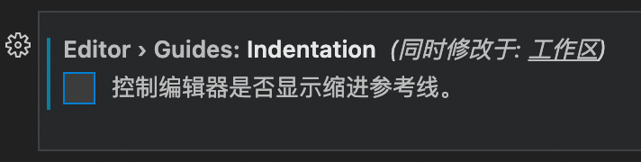
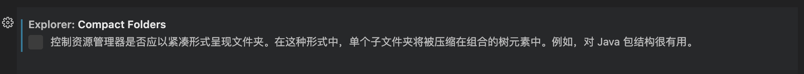

# VSCode
<p id="mXnNVKW66kJzCvc6TBzqpc">

## 使用`eslint`并在保存时修复

</p>


<p id="4GWU42P2jykJ4mMUQ8ZFVU">

安装`eslint`包

</p>


<p id="67W7SmRLFokG4yVPd2oMXa">

```Bash
yarn add -D eslint
```


</p>


<p id="8Kgm481vagNWTRQ7ms4dvy">

然后安装`eslint`插件，并在工程下`.vscode/settings.json`中启用保存时修复

</p>


<p id="pQW6tQLpQvAgpsmnpttzGF">

```JSON
{
    "editor.codeActionsOnSave": {
        "source.fixAll": true
    }
}
```


</p>


<p id="sdyxpjdemKE4ZzqYpiMDjf">

`Stylelint`也是这样的操作

</p>


<p id="d7gqNE79cHCbS6tbSxLqmJ">

## 显示缩进辅助线

</p>


<p id="pq9owh6xzNxLXgdKCzFtyA">

截止`1.65.2`版本，此方法可用

</p>


<p id="8DRn9r6x2iQn5NdRs4HvLx">

缩进辅助线一般是默认开启的，如果因为安装了什么软件导致被关闭了，可以通过以下方式还原：

</p>


1. 修改工作区的设置文件`.vscode/settings.json`，添加一行：
	<p id="gNExcFZ6bpcJvYeSpzkQM2">
	
	```JSON
	{
	  "editor.guides.indentation": true
	}
	```
	
	
	</p>


1. 在设置界面搜索`guid`，找到并勾选以下选项
	<p id="6RZ7QnyAkuE6EhvFHqwb67">
	
	
	
	</p>


<p id="7fSX6dT6vMBNxkrQbZJAjU">

## 丝滑的显示输入指示器

</p>


<p id="dvKYFB1CZkG8hi5Tu3U25c">

```TypeScript
"editor.cursorSmoothCaretAnimation": true,
```


</p>


<p id="r75JNgmrmJrfU13bXQm3Fy">

## 让标签换行

</p>


<p id="rAAgTz9KQCSVBiYdi7PnUP">

```JSON
"workbench.editor.wrapTabs": true,
```


</p>


<p id="gPPjv8osYFU8SvacTeDLPP">

## 让 VSCode 不要省略只有一个子文件夹的路径

</p>


<p id="uf1XjqAAWpux4QEPiMRNhk">



</p>


<p id="rGaKat8hUT7oar3F3eqQJ8">

## Go 插件相关

</p>


<p id="phRaay9YPV1GmkX9tFEB1v">

[不在文件行中显示 run tests | debug tests](./%E4%B8%8D%E5%9C%A8%E6%96%87%E4%BB%B6%E8%A1%8C%E4%B8%AD%E6%98%BE%E7%A4%BA%20run%20tests%20%7C%20debug%20tests/index.md)

</p>


<p id="7qeewYNoGpZxZRuVAR1q5X">

### 配置当前工作区的 Go 版本

</p>


<p id="8fWc7SFbixZHvQ7uPuYEHZ">

在工作区根目录下创建`.vscode/settings.json`并写入

</p>


<p id="hM65U4cF6jeS7SE7kLdsR2">

```JSON
{
  "go.goroot": "<路径>"
}
```


</p>


<p id="27L1Kgs4F8qz9H7CquoMDG">


</p>


